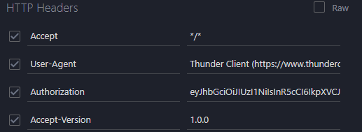
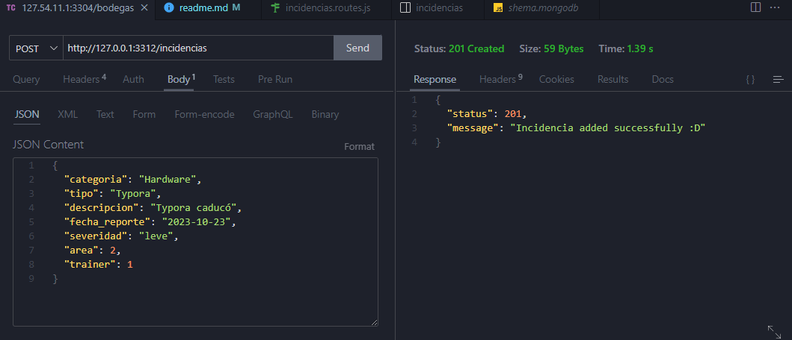
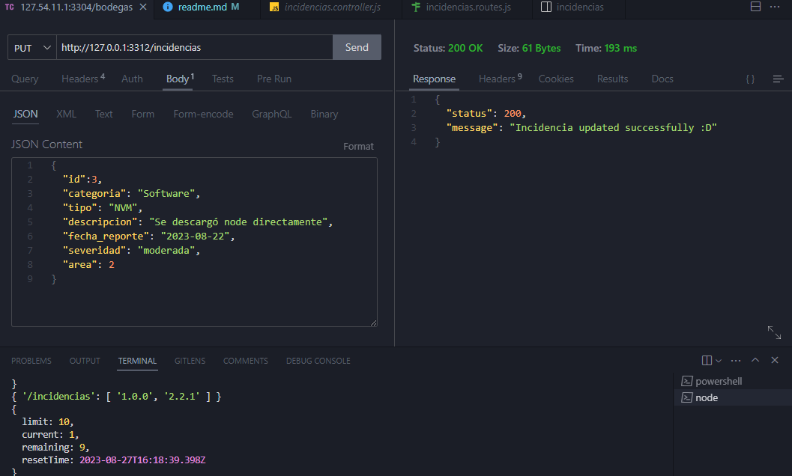
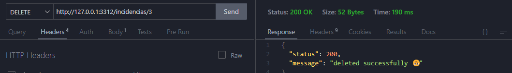
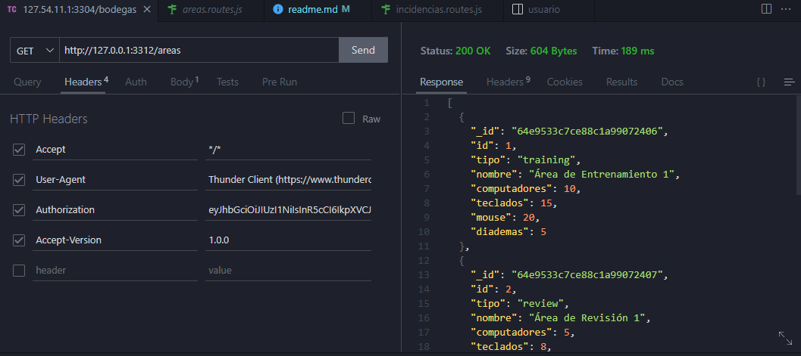

# mongoIncidencias

### Requisitos del sistema

- **Git:** Para poder clonar el repositorio y tener acceso a los commits

- **MongoDB :** Para utilizar el proyecto asegúrese de tener un cluster o una base de datos con mongo, para poder clonar la base de datos utilizada en el proyecto.
- **NodeJs:** Para establecer un entorno de ejecución para JavaScript, en especial la v18.17.1 que es la utilizada en el proyecto.

### Requisitos de extensiónes

- **Thunder Client:** Para realizar peticiones y probar el api se recomienda utilizar esta extensión sin embargo puede utilizarla con otras aplicaciones como lo es postman.
- **MongoDB:** Para conectarse a la base de datos y que el código pueda funcionar correctamente es necesario tenerla instalada.

### Archivo .env

Luego de crear la base de datos con mongodb es necesario establecer nuestras credenciales, para esto creamos un archivo .env y la configuramos según nuestra necesidades. Ejemplo:

```json
SERVER={"host":"127.0.0.1", "port":"3312"}
ATLAS_PASSWORD="campus123"
ATLAS_DB="db_campus_incidencias"
JWT_PASSWORD="C@ampus9$2"
```

### Clonación de la base de datos

Para empezar a hacer peticiones debemos tener información para manipular, así que ve hacía esta dirección del proyecto `config/db/shema.mongodb` . selecciona todo el código y ejecútalo.

### Descargar dependencias

Para instalar las dependencias utilizadas en el proyecto basta con ejecutar el siguiente comando:

```bash
npm i -E
```

### Creación del token

Para las peticiones del proyecto se utiliza JWT para la validación de acceso así que es necesario utilizarla por cada petición. Para crear un token hay que  remplazar por el campo {acceso} el acceso que desea tener para esta petición , siendo estos roles 'admin','incidencias' y 'areas'. El admin tiene accesso a todos los endpoints y todas las versiones, el resto de colecciones tiene acceso solo a las versiones de ellas y a su propio endpoint.

Ejemplo:

```http
http://127.0.0.1:3312/token/admin
```

## Peticiones

### Headers

Para realizar peticiones es necesario enviar el token y la versión a la que se desea utilizar, a continuación un ejemplo del encabezado que se debe enviar:



### /Incidencias

#### Get

Para el método GET se encuentran dos versiones con diferente resultados:

- `1.0.0` : Traerá todo los datos de la colección incidencias
- `2.2.1`: Traerá todas las incidencias que sean de la categoría software

#### Post

Para el método POST de incidencias **TODOS** los parámetros son obligatorios por lo que debe enviar un JSON similar a este, respetando su tipo de dato:
```json
  "categoria": "Hardware",
  "tipo": "Typora",
  "descripcion": "Typora caducó",
  "fecha_reporte": "2023-10-23",
  "severidad": "leve", //'leve', 'moderada', 'critica'
  "area": 2,
  "trainer": 1
```

Sí todo sale como se espera deberá salir un mensaje como este:



#### Put

Para realizar el PUT hace falta agregar el id de la incidencia a la que se desea actualizar, seguido de los parámetros con los cambios.Ejemplo:
```json
{
  "id":3,
  "categoria": "Software",
  "tipo": "NVM",
  "descripcion": "Se descargó node directamente",
  "fecha_reporte": "2023-08-22",
  "severidad": "moderada",
  "area": 2
}
```

Si todo salió bien debe salir este mensaje de aprobación por parte del servidor:


#### Delete

Para eliminar una incidencia solo hace falta conocer el id de ella y usarlo en la url. Ejemplo:

```http
http://127.0.0.1:3312/incidencias/<<id de la incidencia>>
```
Debe salir un mensaje de aprobación como este:



### /areas

#### Get

Para el método GET solo se implementó una versión la `1.0.0` y esta devuelve todos los datos de la colección áreas. Ejemplo:


